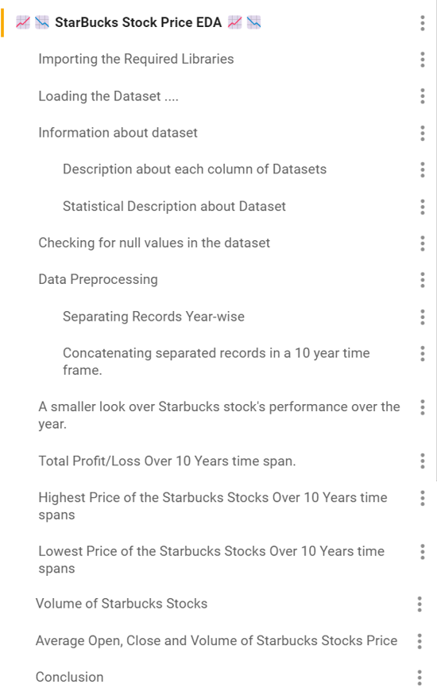

# 📈📉 **Exploratory Data Analysis of Starbucks Stock Prices** 📈📉

## Introudction
&emsp; Starbucks is an American company that operates the largest coffee house chain and one of the most recognizable brands in the world. Headquartered in Seattle, Washington, the company operates more than 35,000 stores across 80 countries (as of 2022).

</img>

In this project, I have performed exploratory data analysis (EDA) on Starbucks stock prices to gain insights into the company’s performance in the Index Markets. I have analyzed the stock prices over the past 30 years and identified trends and patterns that can help us understand investors’ sentiment towards Starbucks stocks.

# Section in EDA :-

</img>

# Tools Used :-

## 1. Language :-
</img>

## 2. Library :-
</img> </img> </img>

## 3. IDE :-
</img>  </img>
